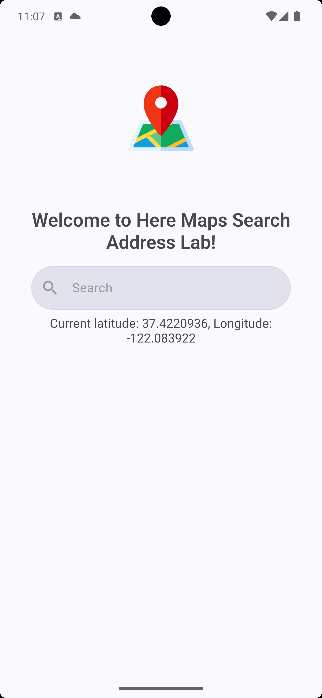

# Search Address Lab

This project is a simple Android application that allows users to search for addresses. The application contains some screens, the address search screen. You can view the main UI of the application [here](https://giphy.com/gifs/IVf4fSVuOWw0MMLN4L).

## Download application from releases to test:
[Link](https://github.com/nqmgaming/search_address/releases)

## Video Demo
Link: [Search Address Lab](https://share.cleanshot.com/WvhP3wPQ)

## Requirements
- Android Studio latest version
- Android SDK
- API Key from [HERE](https://developer.here.com/)
- Internet Connection
- Emulator or Real Device

## UI 

   
   

## Features

1. **Address Search (Required)**: Users can search for an address. The application will return a list of addresses that match the search query.

2. **Display Search Results (Required)**: The application displays the search results in a list. Each item in the list shows the address.

3. **Open Google Maps for Directions (Required)**: Users can click on an address to open Google Maps and get directions to the address.

4. **Highlight Search Keywords in the Result (Optional)**: The application highlights the search keywords in the search results.

5. **Implement 1-second Search Debounce (Optional)**: The application waits for the user to stop typing for 1 second before performing the search. This reduces the number of API calls and improves performance.

## Getting Started

To get started with this project, you need to have the Android SDK and Android Studio installed on your machine.

### API Documentation

The application uses the [HERE Geocoding & Search API](https://www.here.com/docs/bundle/geocoding-and-search-api-v7-api-reference/page/index.html) to perform address searches. You can find the API documentation at the provided link.

### API Authentication

The application uses the [HERE Identity & Access Management](https://www.here.com/docs/bundle/identity-and-access-management-developer-guide/page/topics/app-authentication.html) for API authentication. You can find the authentication documentation at the provided link.

### Register a New App

To use the HERE API, you need to register a new app on the [HERE platform](https://platform.here.com/admin/apps). After registering the app, you will receive an API key. You need to add this API key to the `local.properties` file in your project:

```ini
API_KEY="your_api_key_here"
```

Replace `"your_api_key_here"` with your actual API key.

## Building the Project

To build the project, open it in Android Studio and click on `Build > Make Project`. After the build is successful, you can run the application on an emulator or a real device by clicking on `Run > Run 'app'`.


## Contributing

Contributions are welcome. Please open an issue to discuss your ideas or submit a pull request with your changes.
